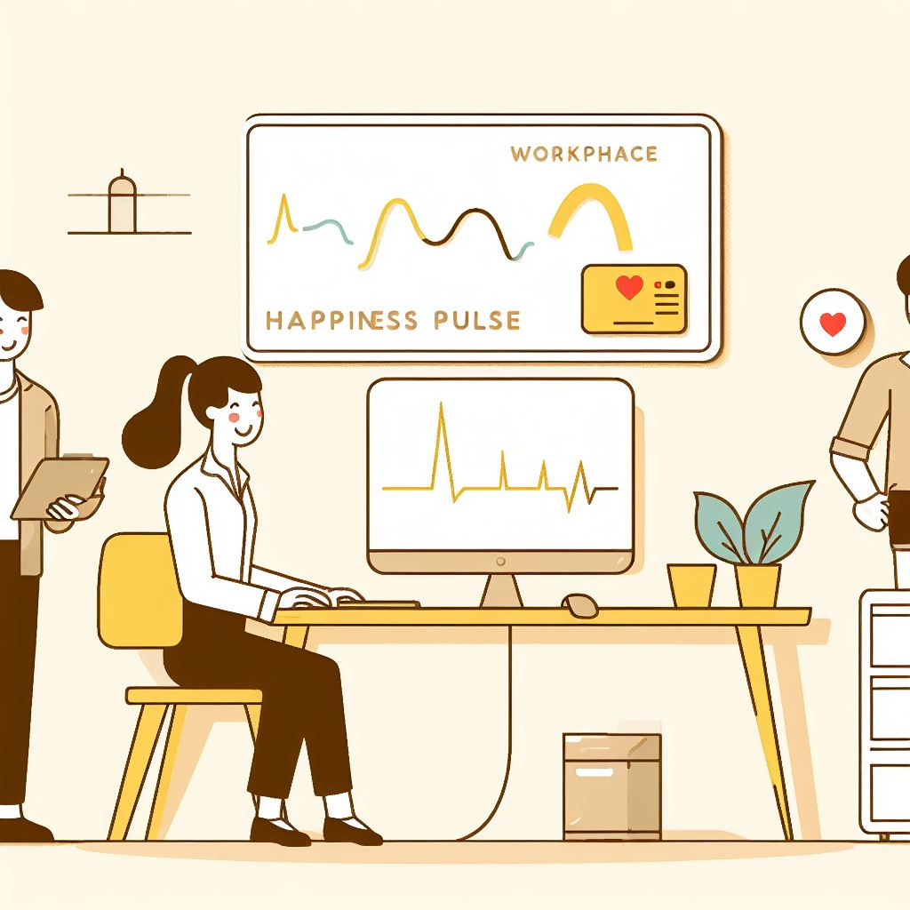

# 😊 Workplace Happiness Pulse – Survey Analytics Dashboard  

  

📝 **[Survey Form Link](https://forms.office.com/r/Q5y2hTL5Ke?origin=lprLink)**  
📂 [Download Tableau Workbook (.twbx)](./Full%20project/Lab%202.twbx)  
📄 [Download Project Report (PDF)](./Full%20project/WORK%20PLACE%20HAPPINESS%20PULSE.pdf)  

---

## 📌 Project Overview  
This project analyzes employee happiness and workplace satisfaction through survey data. Using Tableau dashboards and exploratory data analysis, it uncovers patterns in education, job industry, workplace satisfaction, career growth, and future career decisions. The goal was to highlight key drivers of workplace happiness and provide actionable HR insights.  

---

## 🧩 Dataset  
The dataset was collected from a **Workplace Happiness Pulse Survey**, including:  
- Demographics (education, occupation, industry)  
- Job satisfaction factors (growth opportunities, benefits, compensation, relationships)  
- Career change motivations  
- Future education and career aspirations  

Cleaning process included:  
- Removal of unnecessary columns (IDs, emails, consent)  
- Deletion of empty records  
- Anonymization of personal identifiers  
- Renaming columns for clarity  

---

## 🎯 Objectives  
- Understand patterns of workplace satisfaction and dissatisfaction  
- Identify factors influencing job change decisions  
- Explore career growth motivations and future education trends  
- Provide HR with data-driven insights to improve workplace policies  

---

## 🧠 Tools & Techniques Used  
- **Tableau** – Interactive dashboards and visualizations  
- **Excel** – Data cleaning and preparation  
- **Survey Analysis** – Anonymization, data wrangling, feature extraction  
- **EDA** – Distribution analysis, correlation study, trend identification  

---

## 📊 Key Insights  
- 🎓 Majority of respondents are **well-educated**, with bachelor’s degree holders being the largest group.  
- 💼 IT & Engineering dominate employment sectors; Ph.D. holders often pursue teaching roles.  
- 📈 Dissatisfaction is highest with **growth opportunities**, while benefits and relationships score high satisfaction.  
- 🚪 Organizational support and harassment strongly influence **job change decisions**.  
- 🌱 **Career growth** is the top motivator for switching jobs.  
- 📚 Many respondents are interested in **pursuing further education**, though some remain undecided.  

---

## 📁 Project Deliverables  
- **Workplace_Happiness_Dashboard.twbx** – Tableau packaged workbook  
- **Workplace_Happiness_Report.pdf** – Analysis & insights summary  

---

## ✅ Outcome  
- Delivered an **HR-focused dashboard** highlighting employee satisfaction and job change drivers  
- Provided **data-backed insights** to improve retention and career growth opportunities  
- Encouraged **employee-centric policies** that balance growth, support, and well-being  

---

## 👥 Who Will Benefit  
- 👩‍💼 **HR Teams** – For retention, engagement, and satisfaction improvement  
- 📊 **Executives** – To align workplace culture with business strategy  
- 🎓 **Researchers** – To study workplace happiness and career motivations  
- 🧑‍💻 **Employees** – To voice challenges and opportunities for growth  

---

✨ *“Happiness at work is not a perk — it’s the foundation of productivity and success.”*  
